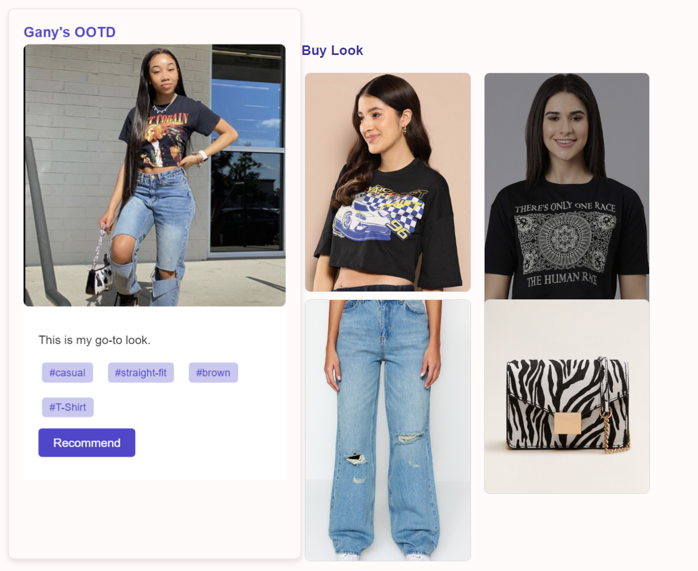
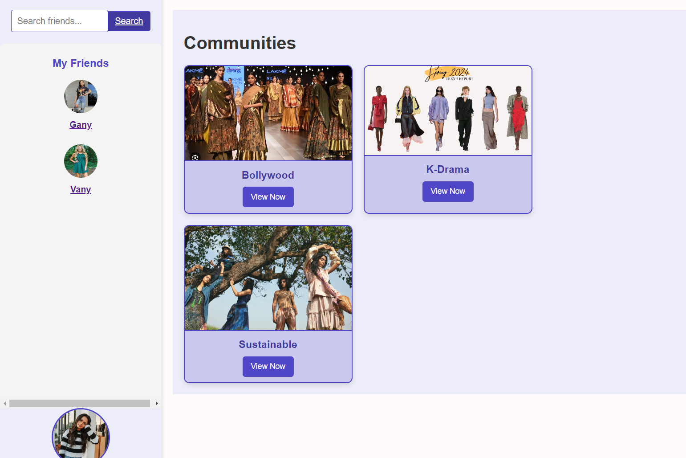
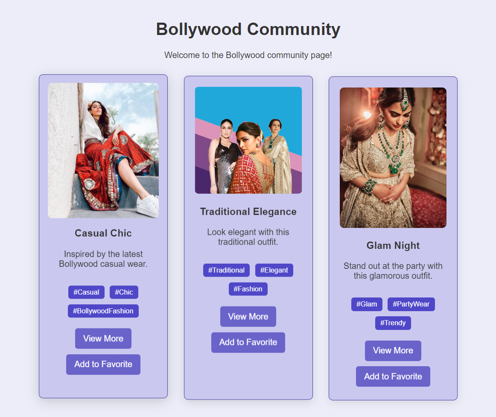
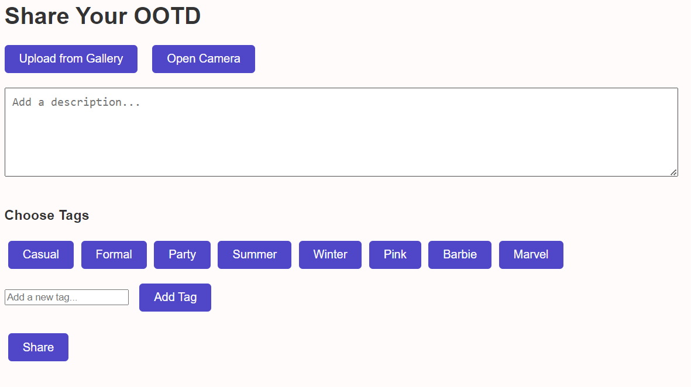

## 📌 Introduction
This project leverages advanced technologies like Trend identification and community-based interaction, to enhance user engagement on the platform.

## ✨ Features


### 🧰 Community Platform: 
- **Real-time chat** along with discussions on fashion and style.
- Users can connect, share their outfits, and get inspired within themed communities.
- Each user has a personal profile for uploading their **Outfit of the Day (OOTD)** with **hashtags**.
- **Themed community pages** like Bollywood, K-Drama, and more.

### 🧰 Visualizations:
- Users can have realistic view of products, enhancing product understanding.

### 👀 Implementation
- Develop a web application.
- Utilize technologies like React.js (frontend), Node.js with Express.js (backend), MongoDB (database).
- Provide similar product recommendations on the community platform.
- Influencer-based communities that help us identify user preferences.

## ⚙️ Installation

1. **Clone the Repository:**

    ```bash
    git clone https://github.com/ishaaaa8/ChicCircle.git
    ```

2. **Launch the Website:**

    ```bash
    cd ChicCircle
    npm install
    npm start
    ```

    This will start a local development server, allowing you to explore the project on your browser.

## 🚀 Usage

After installation, open your browser and go to `http://localhost:3000` to start using the application.

## 🛠 Technologies Used
- **Frontend**: React, HTML, CSS
- **Backend**: Node.js, Express
- **Database**: MongoDB

## 📸 Screenshots
<p align="center">
   
    
</p>

<p align="center">
    
</p>
<p align="center">
    
     
</p>
<p align="center">
   
</p>


