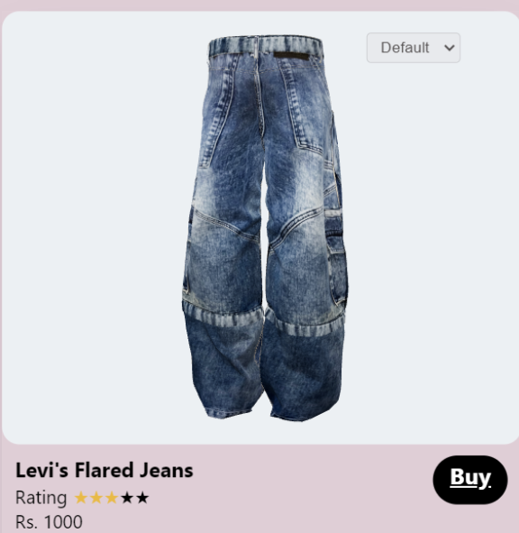

# Myntra-HackerRamp

<p align="center"></p>
<h1 align="center">Myntra HackerRamp</h1>
<p align="center"><b>Revolutionizing Personal Style for Gen-Z with AI, Community, and 3D Visualization</b></p>

## Table of Contents
1. [📌 Introduction](#introduction)
2. [✨ Features](#features)
3. [⚙️ Installation](#installation)
4. [🚀 Usage](#usage)
5. [🛠 Technologies Used](#technologies-used)
6. [📸 Screenshots](#screenshots)

## 📌 Introduction
This project leverages advanced technologies like **Trend identification**, **AI-based recommendations**, **community-based interactions**, and **3D visualizations** to enhance user engagement on the platform.

## ✨ Features
### 🧰 Mix-and-Match: GenZ Oriented On-Platform Experience
- Allows users to visualize different products together on a **3D/2D model customized** based on their body structure.
- Helps users make **informed choices** by seeing entire outfits before purchasing.
- Reduces the chances of returns due to mismatched items, **optimizing supply chain**.

### 🧰 3D Visualizations: GenZ Oriented User Engagement
- Users can view products from **all angles**, enhancing product understanding.
- Provides a **realistic representation** of how clothes will fit and look from all angles.
- Enhances user engagement and helps in better **purchasing decisions**.

### 🧰 Community Platform: Designing and Trend Identification
- **Real-time chat** along with discussions on fashion and style.
- Users can connect, share their outfits, and get inspired within themed communities.
- Each user has a personal profile for uploading their **Outfit of the Day (OOTD)** with **hashtags**.
- **Themed community pages** like Bollywood, K-Drama, and more.
- Fosters a sense of community and drives **user-generated content** to trend.

### 👀 Implementation
- Develop a web application.
- Utilize technologies like React.js (frontend), Node.js with Express.js (backend), MongoDB (database), and WebXL (rendering).
- Provide similar product recommendations on the community platform.
- Use Hashtags (node hashtagify) for trend identification.
- Influencer-based communities that help us identify user preferences.

## ⚙️ Installation

1. **Clone the Repository:**

    ```bash
    git clone https://github.com/ishaaaa8/Myntra-HackerRamp.git
    ```

2. **Launch the Website:**

    ```bash
    cd Myntra-HackerRamp
    npm install
    npm start
    ```

    This will start a local development server, allowing you to explore the project on your browser.

## 🚀 Usage

After installation, open your browser and go to `http://localhost:3000` to start using the application.

## 🛠 Technologies Used
- **Frontend**: React, HTML, CSS
- **Backend**: Node.js, Express
- **Database**: MongoDB
- **3D Models**: `.glb` files
- **3D Model Viewer**: Google Model Viewer, Three.js
- **Rendering Technologies**: WebXR, WebGL
- **Other Tools**: Python, TensorFlow (for ML models), Video Editing Tools

## 📸 Screenshots
<p align="center">
   
    
</p>

<p align="center">
    
</p>
<p align="center">
    
     
</p>
<p align="center">
   
</p>
<p align="center">
     
    
</p>
<!-- <p align="center">
    
</p> -->
## 📽 Video
<p align="center">
  <a href="https://github.com/ishaaaa8/Myntra-HackerRamp/raw/main/7-myntra.mp4" target="_blank">
        
    </a>
</p>
